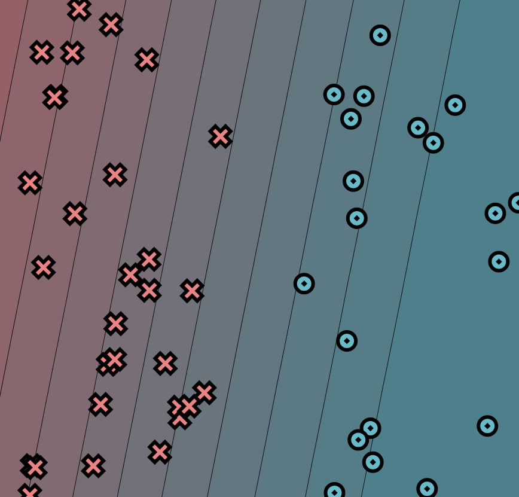

# MiniTorch Module 0

* Docs: https://minitorch.github.io/

* Overview: https://minitorch.github.io/module0/module0/

#### Parameters used:
- `weight_0_0`: -2.53
- `weight_1_0`: 0.48
- `bias_0`: 0.54
- `linear.weight_0_0`: -2.53
- `linear.weight_1_0`: 0.48
- `linear.bias_0`: 0.54

P.S. ChatGPT was used to create docstring for functions.